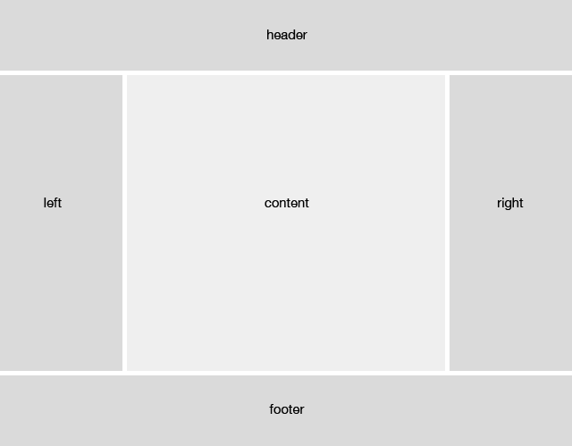
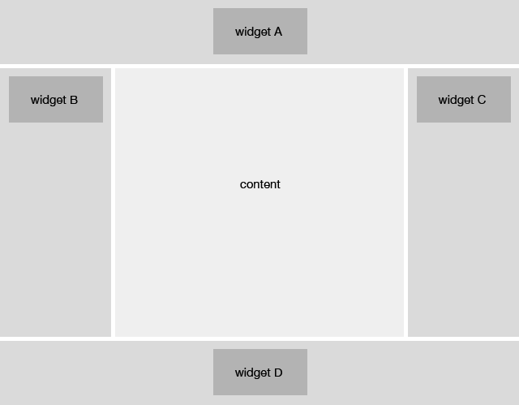
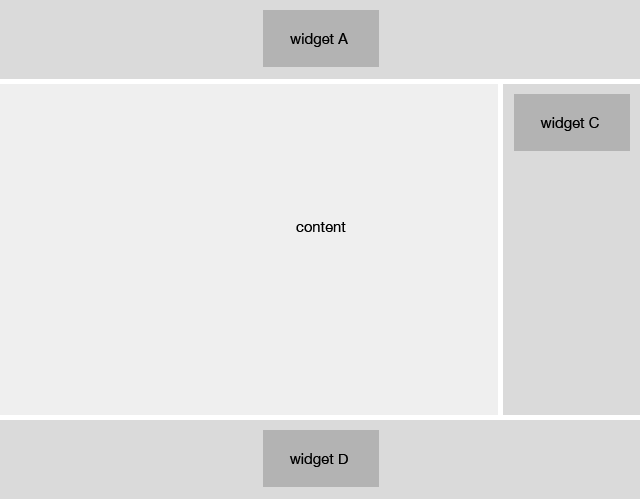
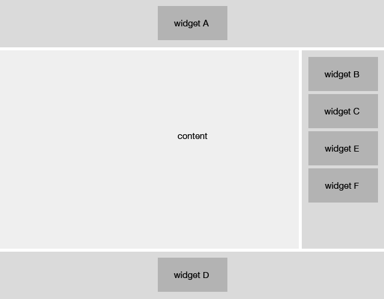

# Templator
## An awesome [Twig](twig.sensiolabs.org) wrapper to control your layout like a boss!

[](https://travis-ci.org/Kristories/Templator)

## What Templator can do for you?

- Focus on position
- Widget can be displayed in all the positions of a template
- This will help reduce redundancy and keep you from writing too much code


## If you are template designer

The template designer has complete control over block positions.


   
    <!DOCTYPE html>
    <html lang="en">
    <head>
        <title>{{ title }}</title>
    </head>
    <body>
        
        
        
        
        
    </body>
    </html>
    
## If you are developer

Developer has complete control widgets you want to appear in block positions.

```php
$templator->blocks(array(
    'position' => array('widget')
));
```

#### Let see how it goes



```php
$templator->blocks(array(
    'header'    => array('widget_a'),
    'left'      => array('widget_b'),
    'right'     => array('widget_c'),
    'footer'    => array('widget_d')
));
```

---



```php
$templator->blocks(array(
    'header'    => array('widget_a'),
    'right'     => array('widget_c'),
    'footer'    => array('widget_d')
));
```

---



```php
$templator->blocks(array(
    'header'    => array('widget_a'),
    'right'     => array('widget_b', 'widget_c', 'widget_e', 'widget_f'),
    'footer'    => array('widget_d')
));
```


## Installation

Add the following into your `composer.json` file:

```json
{
    "require": {
        "kristories/templator": "*"
    }
}
```

Then run

```
composer install
```


## Usage

### Basic

```php
$templator = new \Templator\Templator();

// Set data
$templator->data('foo', 'bar');

// Set widgets
$templator->blocks(array(
    'header' => array('logo', 'search')
));

// Render
// base_template    => /templates/base/base_template.html
// page             => /templates/pages/page.html
echo $templator->render('base_template', 'page');
```

### Config

```php
$templator = new \Templator\Templator(array(
    'path'  => array(
        'root'      => 'templates',
        'base'      => 'base',
        'pages'     => 'pages',
        'widgets'   => 'widgets'
    ),
    'cache' => NULL
));
```

Structure :

```
├── templates/
|   ├── base/
|   |   └── base_template.html
|   ├── pages/
|   |   ├── home.html
|   |   ├── about.html
|   |   ├── contact.html
|   |   └── ...
|   └── widgets/
|   |   ├── logo.html
|   |   ├── menu.html
|   |   ├── tags.html
|   |   ├── search.html    
|   |   └── ...
└── cache/
```

### Data

```php
$templator->data('foo', 'bar');
// or
$templator->data(array(
    'foo' => 'bar',
    'bar' => 'baz'
));
```

### Widgets

```php
$templator->blocks(array(
    'header' => array('logo', 'mainmenu', 'search'),
    'footer' => array('copyright, 'footermenu')
));
```

### Render

```php
$templator->render('base_template', 'page');
```

## Example

[templator-bootstrap](https://github.com/Kristories/templator-bootstrap)

---

## Why Twig?

### Twig is a modern template engine for PHP

- **Fast**: Twig compiles templates down to plain optimized PHP code. The overhead compared to regular PHP code was reduced to the very minimum.
- **Secure**: Twig has a sandbox mode to evaluate untrusted template code. This allows Twig to be used as a template language for applications where users may modify the template design.
- **Flexible**: Twig is powered by a flexible lexer and parser. This allows the developer to define its own custom tags and filters, and create its own DSL.
